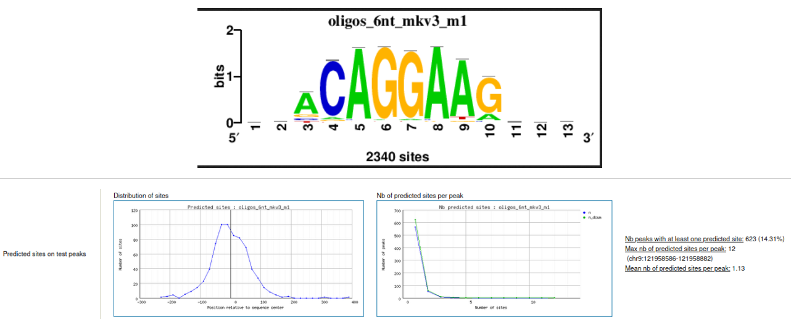

# ATAC-seq analysis of PU.1 Downregulation in Leukemogenesis
## Overview
This repository contains analysis workflow for atac-seq data from this [paper](https://doi.org/10.1038/s44318-024-00295-y).
The study aims to show that overexpression of RUNX.1 ensures cell survival during leukemogenesis upon 
PU.1 downregulation. This repository carries out an independent analysis of atac-seq data from the 
study between wildtype and PU.1 knockdown GMP cells.

## Workflow
- Data acquisition
- Quality Control
- Alignment
- Finding Differential Signal Between Conditions  
- Motif enrichment analysis
- Linking peaks to genes
- Functional Analysis

## Example of enriched motif in the differentially accessible regions between conditions

